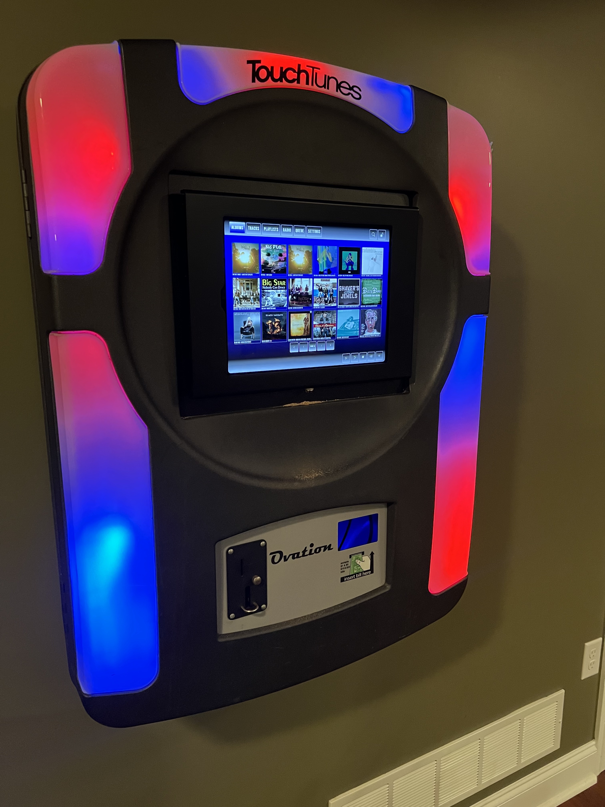
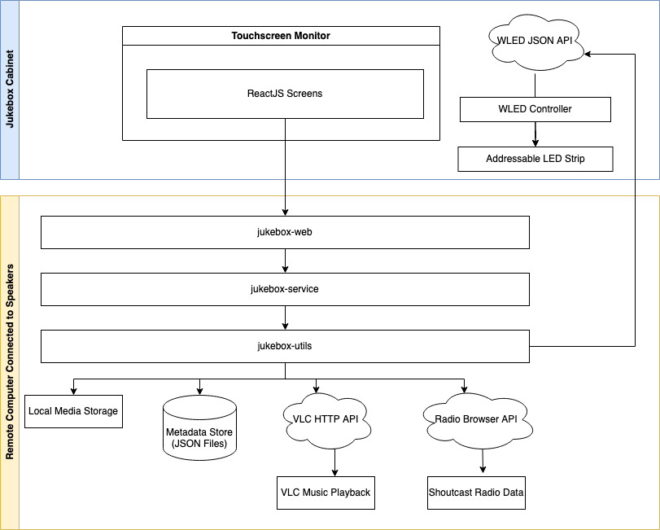

# Jukebox

Jukebox is a server / browser based music player that is intended for use in home touch screen jukeboxes. 



# Table of Contents
1. [Overview](#overview)
2. [Architecture](#architecture)
3. [Getting Started](#getting-started)
4. [Configuration](#configuration)
    1. [Music Library](#music)
    2. [Skins](#skins)
    3. [Lighting](#skins)

## Overview

The motivation for this project is to create a fast, intuitive, visually appealing touch screen jukebox frontend for home use. This frontend is intended for use in DIY jukebox cabinets.

## Architecture

The Jukebox project is composed of the following three components:
- [Jukebox Web](https://github.com/brian-thornton/jukebox-web): This is the React JS based web frontend.
- [Jukebox Service](https://github.com/brian-thornton/jukebox-service): This service is responsible for communications between the frontend and the computer hooked up to speakers.
- [Jukebox Utils](https://github.com/brian-thornton/jukebox-utils): A utility library which does the work of playing music, storing playlists, managing the queue etc.



## Getting Started

Run the command below to install and start jukebox.
```
curl -o- https://raw.githubusercontent.com/brian-thornton/jukebox-web/master/scripts/mac.sh | bash
```

## Configuration

### Music

Once jukebox is running, navigate to Settings to configure your library of music. Jukebox expects your music to exist in one or more parent folders called libraries. These folders might categorize your collection in some way such as 'holiday music', 'oldies' etc. Parent folders are expected to contain subdirectories which represent albums.  For example:

/oldies (library 1)\
&nbsp;&nbsp;&nbsp;&nbsp;oldies/artist - album\
&nbsp;&nbsp;&nbsp;&nbsp;/oldies/artist - album\
/holiday (library 2)\
&nbsp;&nbsp;&nbsp;&nbsp;/holiday/artist - album\
&nbsp;&nbsp;&nbsp;&nbsp;/holiday/artist - album

Once your libraries have been entered press the scan button next to each. The jukebox will scan the albums and tracks and store the information in a JSON file for fast retrieval. If you add or remove content from your library you will need to scan again. Once scanning is complete click 'Albums' to view your music.

### Skins
Jukebox is fully skinnable. You can control colors and fonts to give your Jukebox a custom look and feel. You can find skins under Settings > Skins. Jukebox ships with a few built in skins 'out of the box'. You can copy these skins as a starting point for your own customizations.

### Lighting
Jukebox supports the control of WS2812B individually addressable LED strips to enhance the look of DIY jukebox cabinets. LED strip control is managed through [WLED](https://kno.wled.ge/). Jukebox can control any WLED controller on the local network meaning that your LED strips can be installed in your jukebox cabinet but also may be remote to the physical cabinet. Jukebox can manage 1..n WLED controllers. 

Jukebox creates lighting effects by assigning WLED presets when navigation events take place in the Jukebox web front end. Users can configure the preset that should be applied for each navigation event. For example, Jukebox can be configured to turn LEDs green when a user clicks 'Albums', blue when a user clicks 'Tracks' and so on. These lighting configurations are associated to skins so that colors and effects compliment screen colors. In order to configure this behavior follow these steps.

- LED configuration starts with hardware. In order to set up LED management with Jukebox you must have a WLED enabled controller connected to a WS2812B LED strip, plugged in and connected to your local network. The links to the hardware used in this project can be found below:
  - [WLED Controller](https://www.athom.tech/wled)
  - [Power Supply](https://www.amazon.com/gp/product/B078RZBL8X/ref=ppx_yo_dt_b_search_asin_title?ie=UTF8&psc=1)
  - [Bare Wire Connectors](https://www.amazon.com/gp/product/B08PYT6HZ2/ref=ppx_yo_dt_b_search_asin_title?ie=UTF8&psc=1)
  - [LED Strip](https://www.amazon.com/gp/product/B01CDTEJBG/ref=ppx_yo_dt_b_search_asin_title?ie=UTF8&th=1)
- Once the LED strip is powered on and connected to the network navigate to the WLED web UI and configure presets to illuminate the LED segments with the colors and effects you wish to use with the Jukebox.
- Return to the Jukebox UI and navigate to Settings > Cabinet.
- In the Cabinet menu click discover to locate the WLED controllers on your network.
- Navigate to Settings > Skins and edit the skin for which you want to set up lighting events.
- Click the lighting tab in the skin edit screen.
- Click edit on the WLED controller for which you want to configure lighting events.
- Click configure on the navigation event for which you want to configure lighting. 
- Enable the preset that you want to apply when the navigation event fires.
- Repeat this process for any navigation events for which you would like to apply lighting.
- Save the skin and apply it to enable the lighting effects.